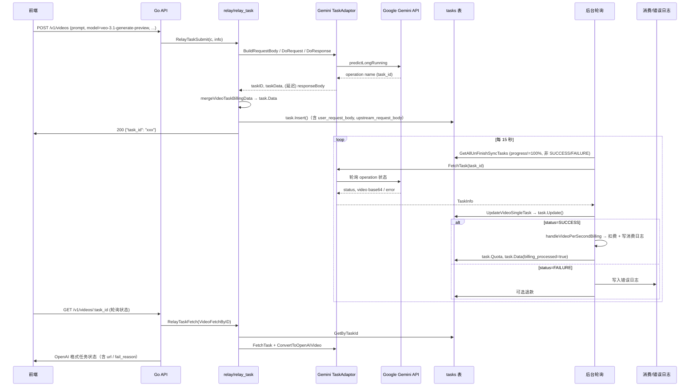

# Gemini Veo 模型生成视频完整流程

本文档描述从前端发起请求到视频生成完成、扣费与日志记录的全链路，包括数据流转、`tasks` 表字段更新时机，以及按秒计费与消费日志的写入逻辑。

---

## 一、整体架构概览

- **提交阶段**：前端只拿到 `task_id`，不在此阶段扣费。
- **轮询阶段**：后台定时拉取未完成任务，调用 Gemini 查状态，更新 `tasks`；**仅在轮询到 SUCCESS 时**做按秒计费并写消费日志。
- **前端轮询**：GET `/v1/videos/:task_id` 从 DB 读任务并用 Gemini Adaptor 转成 OpenAI 格式返回（含视频 URL 或错误原因）。

---

## 二、阶段一：提交任务（POST /v1/videos）

### 2.1 路由与渠道选择

- 请求路径：`POST /v1/videos`（或 `/v1/video/generations`）。
- `middleware/distributor` 根据 path 设置 `relay_mode = RelayModeVideoSubmit`，并做渠道选择（若未指定则按模型名等选 channel）。
- 若选中的 channel 类型为 **Gemini**（`constant.ChannelTypeGemini`），则后续使用 **Gemini TaskAdaptor**；platform 为 `TaskPlatform(strconv.Itoa(ChannelTypeGemini))`，用于写 `tasks.platform` 和后续轮询时取对应 adaptor。

### 2.2 RelayTaskSubmit 流程（relay/relay_task.go）

1. **InitChannelMeta / 校验**  
   初始化 `RelayInfo`，处理 remix 等逻辑。

2. **GetTaskAdaptor(platform)**  
   platform 来自 channel 类型，Gemini 渠道得到 `taskGemini.TaskAdaptor`。

3. **ValidateRequestAndSetAction（Gemini Adaptor）**  
   - 解析请求体（prompt、model、metadata 等）。  
   - 从 body 中解析 Veo 参数（如 `durationSeconds`、`aspectRatio`、`resolution`、`generate_audio`）写入 `task_request.Metadata`，并把 `durationSeconds` 写入 `c.Set("video_seconds", n)`，供后续计费/入库用。

4. **配额校验**  
   - 按秒计费模型（`isVideoPerSecondModel(modelName)` 为 true，即 options 中配置了 VideoModelPricePerSecond）**不在此处预扣**，仅用「估算 quota」做余额校验（防止超额提交）。

5. **BuildRequestBody（Gemini）**  
   - 将 `task_request` 转成 Gemini 的 `predictLongRunning` 请求体（instances + parameters，含 durationSeconds、aspectRatio、resolution、includeAudio 等）。  
   - 得到 `upstreamBodyBytes`（上游请求体），后续会写入 `task.upstream_request_body`（并做 base64 截断）。

6. **DoRequest**  
   - 请求 `POST {baseURL}/{version}/models/{modelName}:predictLongRunning`，带 `x-goog-api-key`。  
   - 上游返回 JSON，其中 `name` 为 operation 名称，用作唯一标识。

7. **DoResponse（Gemini）**  
   - 解析上游 JSON，得到 `name`，再 base64 编码得到本地 `task_id`。  
   - **延迟写响应**：若 `c.Get(TaskSubmitDelayResponse)==true`，则不 `c.JSON`，而是把要返回的 JSON 序列化后 `c.Set(TaskSubmitResponseBody, body)`，直接 return。  
   - 这样可避免「先写了 200 + task_id，后面 task.Insert 失败或重试再写一次」导致响应体被写两段。

8. **mergeVideoTaskBillingData**  
   按秒计费时，把计费所需字段合并进 `taskData`（即将写入 `task.Data`），包括：  
   - `billing_model_name`, `billing_group`, `billing_oem_code`, `billing_oem_user_discount`, `billing_effective_group_ratio`  
   - `billing_token_name`, `billing_token_id`  
   - `requested_seconds`（来自 context 的 video_seconds 或从 upstream body 解析）  
   - `generate_audio` / `generateAudio`  
   - `billing_processed = false`  
   这些字段在后续轮询合并上游响应时会通过 **preservedFields** 保留，不被覆盖。

9. **构造 task 并入库**  
   - `task := model.InitTask(platform, info)`：填充 UserId, Group, ChannelId, Platform, Properties（OriginModelName, UpstreamModelName）, PrivateData（Gemini 时存 ApiKey）等。  
   - 按秒计费：`task.Quota = 0`，`task.Properties.RequestedSeconds = resolveRequestedSeconds(...)`。  
   - `task.Data = taskData`（含上述计费字段）。  
   - `task.Action = info.Action`。  
   - **user_request_body / upstream_request_body**：  
     - `task.UserRequestBody = TruncateBase64Content(用户原始 body)`  
     - `task.UpstreamRequestBody = TruncateBase64Content(upstreamBodyBytes)`  
     仅截断 base64 字符串，其它属性不截断；轮询逻辑**不会修改**这两个字段。  
   - `task.Insert()` 写入 DB。

10. **写响应**  
    若 context 中有 `TaskSubmitResponseBody`，则 `c.Data(200, "application/json", body)` 只写一次，返回前端 `{"task_id": "xxx"}`（或 adaptor 定义的其它 JSON 结构）。

### 2.3 提交阶段 tasks 表字段写入汇总

| 字段 | 来源/说明 |
|------|------------|
| platform | channel 类型（Gemini 即对应常量） |
| user_id, `group`, channel_id | RelayInfo |
| quota | 按秒计费时为 0 |
| status | NOT_START（InitTask 默认） |
| progress | 0% |
| submit_time | 当前时间戳 |
| action | info.Action（如 text-generate） |
| properties | OriginModelName, UpstreamModelName, RequestedSeconds |
| private_data | Gemini 时存 ApiKey（用于轮询拉取） |
| data | 上游提交响应 + mergeVideoTaskBillingData 的计费字段 |
| user_request_body | 用户原始请求 JSON（base64 截断） |
| upstream_request_body | 发给 Gemini 的请求 JSON（base64 截断） |
| task_id | 上游 operation name 的 base64 编码 |

---

## 三、阶段二：后台轮询更新任务（UpdateVideoTaskAll）

### 3.1 轮询触发（controller/task.go）

- 定时任务每 **15 秒** 执行一次。  
- `model.GetAllUnFinishSyncTasks(limit)`：查询 `progress != '100%'` 且 `status NOT IN (SUCCESS, FAILURE)` 的任务，按 platform 分组。  
- 对每个 platform 调用 `UpdateVideoTaskAll(platform, taskChannelM, taskM)`；视频任务会进入 `UpdateVideoTaskAll`（controller/task_video.go），按 channel 维度逐个调用 **UpdateVideoSingleTask**。

### 3.2 UpdateVideoSingleTask 流程（controller/task_video.go）

1. **取 channel、adaptor**  
   根据 `task.ChannelId` 取 channel，`relay.GetTaskAdaptor(platform)` 得到 Gemini TaskAdaptor（platform 来自 task 表）。

2. **FetchTask（Gemini）**  
   - 用 `task.TaskID`（即本地 base64 的 operation name）解码得到上游 operation 名。  
   - 请求 Gemini 的「查询 operation 状态」接口，拿到最新状态与结果（含视频 base64 或 error）。

3. **ParseTaskResult**  
   - 解析上游 JSON：若 `error.message` 非空则得到 FAILURE + Reason；否则根据 `done`、`response.videos` 等得到 SUCCESS 和 base64 或 REMOTE_URL。  
   - 返回 `TaskInfo`：Status、Progress、Url（或 Reason）。

4. **合并 task.Data（保留计费字段）**  
   - 将本次上游响应解析为 `newData`，与库里的 `task.Data`（existingData）合并。  
   - **preservedFields**：  
     `requested_seconds`, `billing_requested_seconds`, `billing_model_name`, `billing_group`, `billing_oem_code`, `billing_oem_user_discount`, `billing_effective_group_ratio`, `billing_token_name`, `billing_token_id`, `billing_processed`, `generate_audio`, `generateAudio`  
   - 这些键从 existingData 拷贝到 newData，再写回 `task.Data`，避免被上游响应覆盖。  
   - **注意**：`user_request_body`、`upstream_request_body` 是独立列，轮询只读写 `task.Data`，不会改这两列。

5. **按状态更新 task 内存对象**  
   - **SUBMITTED**：progress=10%。  
   - **QUEUED**：progress=20%。  
   - **IN_PROGRESS**：progress=30%，若 `start_time` 为 0 则设为当前时间。  
   - **SUCCESS**：  
     - progress=100%，`finish_time` 若为 0 则设为当前时间。  
     - Veo 模型（名称前缀 `veo-`）：不传 OSS，直接把 `taskResult.RemoteUrl` 或 `taskResult.Url` 写入 **task.FailReason**（复用该字段存视频 URL 或 data URI）。  
     - 若是按秒计费模型：调用 **handleVideoPerSecondBilling**（见下）。  
   - **FAILURE**：  
     - progress=100%，`finish_time` 同上。  
     - **task.FailReason = taskResult.Reason**（上游错误信息）。  
     - 若之前有预扣 quota，则标记应退款；并写入 **错误日志**（model.LOG_DB，类型 LogTypeError，内容含模型与 fail_reason）。

6. **task.Update()**  
   将当前 task 对象（含 status、progress、data、fail_reason、start_time、finish_time、quota 等）全量写回 `tasks` 表。

7. **退款**  
   若本轮变为 FAILURE 且之前有预扣（quota>0）且前一次状态不是 FAILURE，则 `IncreaseUserQuota` 退款并写一条系统日志。

### 3.3 轮询阶段 tasks 表字段更新汇总

| 字段 | 更新时机 |
|------|----------|
| status | 每次轮询按上游状态更新（SUBMITTED/QUEUED/IN_PROGRESS/SUCCESS/FAILURE） |
| progress | 10% / 20% / 30% / 100% |
| start_time | 首次进入 IN_PROGRESS 时 |
| finish_time | 进入 SUCCESS 或 FAILURE 时 |
| fail_reason | SUCCESS 时存视频 URL（Veo 不传 OSS 则 base64 data URI 或 GCS URL）；FAILURE 时存上游错误信息 |
| data | 上游响应与 existingData 合并，保留 preservedFields，再写回 |
| quota | 仅当 SUCCESS 且按秒计费时，在 handleVideoPerSecondBilling 中设为实际扣费值 |
| user_request_body, upstream_request_body | **轮询不修改**，保持提交时写入的值 |

---

## 四、按秒计费与消费日志（handleVideoPerSecondBilling）

仅在 **轮询到 status=SUCCESS** 且该任务为按秒计费模型（options 中配置了 VideoModelPricePerSecond）时调用。

### 4.1 防重复计费

- 从 `task.Data` 读 `billing_processed`；若已为 true，直接 return，不再扣费、不写日志。

### 4.2 requested_seconds 来源（优先级从高到低）

1. **task.UpstreamRequestBody**  
   解析 JSON，先取顶层 `durationSeconds`；若无则取 `instances[0].durationSeconds`（与 Gemini 上游 body 结构一致）。  
2. **task.Data**：`requested_seconds`、`billing_requested_seconds`、`seconds`。  
3. **task.Properties.RequestedSeconds**。  
4. Veo 兜底：若仍 ≤0，则按 4 秒。

### 4.3 价格与扣费公式

- **官方单价**：`ratio_setting.GetVideoModelPricePerSecondForBilling(modelName, generateAudio)`（options 中 VideoModelPricePerSecond，Veo 非 fast 按 noAudio/audio 区分）。  
- **OEM 用户折扣**：从 task.Data 的 `billing_oem_user_discount` 或按用户重新取。  
- **分组倍率**：从 task.Data 的 `billing_effective_group_ratio` 或回退到 group 配置。  
- 公式：  
  `effectiveVideoPrice = officialVideoPrice × oemUserDiscount`  
  `actualQuota = effectiveVideoPrice × requestedSeconds × QuotaPerUnit × groupRatio`  
  再取整为 int。

### 4.4 执行动作

- **model.DecreaseUserQuota(task.UserId, actualQuota)**：扣用户额度。  
- **model.UpdateUserUsedQuotaAndRequestCount / UpdateChannelUsedQuota**：更新用户与渠道用量。  
- **消费日志（LOG_DB）**：  
  - Type: LogTypeConsume。  
  - Content：如「视频任务成功，模型 xxx，时长 N 秒，耗时 Xs，扣费 xxx」。  
  - 其它字段：ChannelId, ModelName, Quota, CompletionTokens（这里存 requestedSeconds）, TokenName, TokenId, Group, Other（JSON，含 requested_seconds、价格链、billing_type=per_second 等），以及价格链相关字段（OfficialQuota, CostQuota, UserQuota 等）。  
- **更新 task**：  
  - `task.Quota = actualQuota`。  
  - `task.Data` 中设 `billing_processed = true`，再写回 DB（同一轮中后续 `task.Update()` 会持久化）。

若扣费或写日志失败，会将任务置为 **FAILURE**，`task.FailReason` 设为 `billing_failed: ...`，防止未扣费却返回成功。

---

## 五、前端轮询任务状态（GET /v1/videos/:task_id）

- `relay_mode = RelayModeVideoFetchByID`，进入 **RelayTaskFetch** → **videoFetchByIDRespBodyBuilder**。  
- 根据 `task_id` 和当前用户从 DB 取 `originTask`。  
- 若是 Vertex/Gemini 渠道，会**顺带**再请求一次上游 FetchTask，用最新状态和 URL 更新内存中的 `originTask`（含 FailReason）；但若任务已是 SUCCESS/FAILURE，**不把 status/progress 写回 DB**，只可能更新 `fail_reason`（如仅 `TaskUpdateFailReason`），以保证计费只由后台轮询执行一次。  
- 对 `/v1/videos/` 路径，用 **ConvertToOpenAIVideo** 将 task 转成 OpenAI 兼容格式（含 id、status、progress、url、error 等），其中：  
  - 成功时：url 来自 `task.FailReason`（视频 URL 或 data URI）。  
  - 失败时：error 信息来自 `task.FailReason`。  
- 返回给前端的 JSON 即该 OpenAI 格式，不包含 `user_request_body`、`upstream_request_body`（表中也为不对外字段）。

---

## 六、数据流转小结

| 阶段 | 数据来源 | 写入/更新位置 |
|------|----------|----------------|
| 提交 | 用户 body | user_request_body（截断 base64）、Properties.RequestedSeconds、data 中 requested_seconds |
| 提交 | 上游请求体 | upstream_request_body（截断 base64）、mergeVideoTaskBillingData 写入 data 的计费字段 |
| 提交 | 上游提交响应 | task.Data 原始响应 + 计费字段，task_id 存 operation 的 base64 |
| 轮询 | 上游轮询响应 | task.Data 合并（保留计费字段），status/progress/fail_reason/start_time/finish_time |
| 轮询 SUCCESS | task.Data + UpstreamRequestBody | 计费用 requested_seconds、generate_audio 等；扣费后 task.Quota、data.billing_processed |
| 计费后 | 价格链与用量 | LOG_DB 消费日志；用户/渠道额度更新 |

---

## 七、tasks 表字段在 Gemini Veo 流程中的角色

| 字段 | 提交时 | 轮询时 | 说明 |
|------|--------|--------|------|
| task_id | 写入（operation 的 base64） | 不变 | 唯一标识，轮询与前端查询用 |
| platform | 写入（Gemini 渠道） | 不变 | 决定用哪个 TaskAdaptor |
| status / progress | 初始 NOT_START / 0% | 每次轮询更新 | 终态 SUCCESS/FAILURE 才扣费或退款 |
| fail_reason | 空 | SUCCESS 存视频 URL，FAILURE 存错误信息 | 前端通过 ConvertToOpenAIVideo 的 url/error 返回 |
| data | 提交响应+计费字段 | 合并上游响应并保留 preservedFields | 计费与 billing_processed 依赖此 JSON |
| quota | 0（按秒计费） | SUCCESS 后改为实际扣费值 | 扣费在 handleVideoPerSecondBilling 中完成 |
| properties | OriginModelName, UpstreamModelName, RequestedSeconds | 不变 | 计费兜底用 RequestedSeconds |
| user_request_body | 用户原始 JSON（截断 base64） | **不更新** | 仅存留，计费不依赖 |
| upstream_request_body | 上游请求 JSON（截断 base64） | **不更新** | 计费优先从此取 durationSeconds |
| private_data | Gemini 存 ApiKey | 不变 | 轮询 FetchTask 时用 |

以上即 Gemini Veo 模型生成视频的完整流程、数据流转、tasks 表字段更新以及扣费与日志记录说明。
