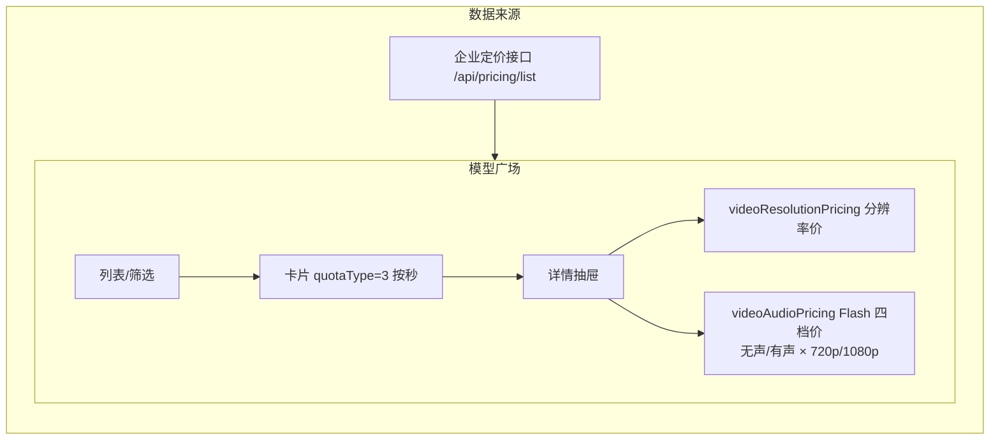
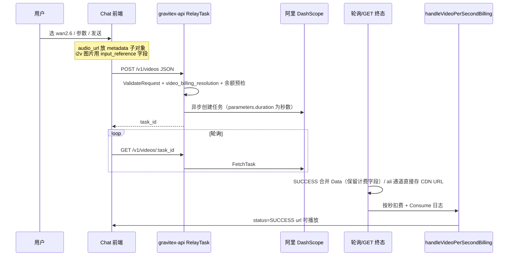

# 万相 2.6 视频：模型广场展示、Chat 入参与后端轮询 / 扣费 / 日志场景说明

本文描述 **gravitex-api-cli** 中「模型广场」与 **Chat 视频模式** 对 **wan2.6** 系列模型的展示与请求形态，以及 **gravitex-api（Go）** 侧任务提交、异步轮询、成功结算、消费日志与关键日志前缀的对应关系。实现以当前代码为准。

---

## 1. 涉及模型 ID（与通道配置一致）

| 模型 | 说明 |
|------|------|
| `wan2.6-t2v` | 文生视频 |
| `wan2.6-i2v` / `wan2.6-i2v-flash` | 图生视频 / Flash |
| `wan2.6-r2v` / `wan2.6-r2v-flash` | 参考生视频 / Flash |

按秒计费与分档价配置见 `setting/ratio_setting/model_ratio.go` 中 `VideoModelPricePerSecond` / `VideoFlashResolutionPricing`（Flash 为 **无声/有声 × 720p/1080p** 嵌套四档价）。

---

## 2. 模型广场展示场景（gravitex-api-cli / `pages/Models`）

### 2.1 计费类型标签

- 定价接口返回的 `quotaType === 3` 时，前端展示为 **「按秒计费」**（`getBillingTypeLabel`）。

### 2.2 价格展示（与后端 JSON 对齐）

- **非 Flash 按秒模型**：详情抽屉结合 `videoResolutionPricing`（`resolutions` JSON）展示分辨率相关说明。
- **Flash 四档**：若 **`videoAudioPricing`** 为 **嵌套结构**（`noAudio` / `audio` 下再分 `720p` / `1080p`），则在「音频选项」下展示 **无声/有声 × 各分辨率** 单价。

  后端定价数据结构（`defaultVideoFlashResolutionPricing`）：
  ```json
  {
    "wan2.6-i2v-flash": {
      "noAudio": { "720p": 0.0214, "1080p": 0.0357 },
      "audio":   { "720p": 0.0429, "1080p": 0.0714 }
    },
    "wan2.6-r2v-flash": {
      "noAudio": { "720p": 0.0214, "1080p": 0.0357 },
      "audio":   { "720p": 0.0429, "1080p": 0.0714 }
    }
  }
  ```

  前端解析逻辑（`pages/Models/index.tsx`）：
  - `parseVideoAudioPricingJson`：解析 `videoAudioPricing` / `originVideoAudioPricing` JSON。
  - `getVideoAudioResolutionMap`：取 `noAudio` 或 `audio` 下的嵌套分辨率 map（`{ "720p": price, "1080p": price }`）。
  - `hasVideoAudioResolutionNested`：判断是否为嵌套结构，是则走四档展示，否则走扁平展示。

  **数据源**：后端企业定价接口（`/api/pricing/list`）返回的各模型 `videoAudioPricing` 字段须为嵌套结构，Go 侧 flash 模型数据库配置应与 `defaultVideoFlashResolutionPricing` 一致。

### 2.3 场景图（用户视角）



---

## 3. Chat 视频模式：HTTP 与鉴权

| 项目 | 说明 |
|------|------|
| 提交 | `POST {LLM_API_BASE_URL}/v1/videos`，非 Sora 时为 **JSON**（见 `services/videoGenerateService.ts` → `buildJsonBody`） |
| 轮询 | `GET {LLM_API_BASE_URL}/v1/videos/:task_id`，`Authorization: Bearer <apiKey>`；提交成功后会把 key 写入 `sessionStorage` 供轮询使用（`storeVideoApiKey` / `getStoredVideoApiKey`） |
| 后端路由 | `router/video-router.go`：`POST/GET /v1/videos` → `controller.RelayTask` |

---

## 4. Chat 组装的 wan2.6 请求体（`pages/Chat/index.tsx`）

以下字段在 `selectedModel.includes('wan2.6')` 分支写入 `requestData`，再经 `submitVideoTask` 以 JSON 发往网关（内部字段 `apiKey` / `apiBaseUrl` 会剥离，不进入 body）。

### 4.1 通用字段

| 字段 | 含义 |
|------|------|
| `model` | 模型 ID |
| `prompt` | 文案 |
| `duration` | 时长（秒），来自页面 `videoDuration` |
| `smart_rewrite` | 智能改写，对应状态 `wan26SmartRewrite` |
| `watermark` | 固定传 `false` |

### 4.2 文生 / 参考生（`t2v` / `r2v`）

- 使用 **`size`**：`ModelCapabilities.getWan26T2VSize(wan26Resolution, wan26AspectRatio)`，将 **720p/1080p + 宽高比** 转为 `宽*高`（如 `1280*720`），见 `pages/Chat/modelConstants.ts` 中 `getWan26T2VSize`。

### 4.3 图生（`i2v`，非 t2v/r2v）

- 使用 **`resolution`**：`'720p' | '1080p'`（`wan26Resolution`）。
- 需要 **`input_reference`**（JSON 字段名），首帧图 OSS URL。
  > **注意**：后端 `ali adaptor` 中 `convertToAliRequest` 读取的是 `req.InputReference`（对应 JSON 字段 `input_reference`），而非 `image` 字段，传 `image` 会静默丢失。

### 4.4 Flash 有声/无声

- 当 `selectedModel.includes('flash')` 时增加 **`audio`**：`true`/`false`（`wan26AudioEnabled`），与后端 `TaskSubmitReq.Audio` 及按秒分档计费一致。

### 4.5 其它万相参数

| 字段 | 条件 | 含义 |
|------|------|------|
| `shot_type` | `wan26ShotType` 且 `wan26SmartRewrite === true` | `single` / `multi` |
| `seed` | 有有效正整数 | 随机种子 |
| `metadata.audio_url` | 有 URL 且非 `r2v` | 配乐地址（**必须放在 `metadata` 子对象中**） |
| `reference_urls` | `r2v` 且已上传参考 | 参考图/视频 URL 数组（最多 5 个） |

> **`audio_url` 传参规范**：后端 `ali adaptor`（`adaptor.go:422`）从 `req.Metadata["audio_url"]` 读取，因此前端必须将其放在 `metadata` 子对象内：
> ```json
> { "metadata": { "audio_url": "https://..." } }
> ```
> 若直接放顶层（`audio_url: "..."`），后端不读取，音频静默丢失。

### 4.6 前端能力约束（与入参一致）

- **分辨率**：`getVideoResolutions` 对 wan2.6 仅保留 **720p / 1080p**（无 480p）。
- **宽高比**：`getVideoRatios` 对 wan2.6 排除 **adaptive、21:9**。

---

## 5. 网关（Go）请求结构与上下文

### 5.1 `TaskSubmitReq`（`relay/common/relay_info.go`）

与 Chat JSON 对齐的关键字段：

| JSON 字段 | Go 字段 | 用途 |
|---|---|---|
| `model` | `Model` | 模型 ID |
| `prompt` | `Prompt` | 文案 |
| `duration` | `Duration` | 时长（秒） |
| `size` | `Size` | t2v/r2v 尺寸 |
| `resolution` | `Resolution` | i2v 分辨率 |
| `input_reference` | `InputReference` | i2v 首帧图（**非 `image`**） |
| `reference_urls` | `ReferenceUrls` | r2v 参考 URL 数组 |
| `smart_rewrite` | `SmartRewrite` | 智能改写 |
| `shot_type` | `ShotType` | 镜头类型 |
| `audio` | `Audio` | flash 有声/无声 |
| `metadata` | `Metadata` | 透传字典；`audio_url` 放此处 |

### 5.2 阿里适配器（`relay/channel/task/ali/adaptor.go`）

- `convertToAliRequest` 将客户端请求转为 DashScope 体：
  - `req.InputReference` → `aliReq.Input.ImgURL`（i2v 首帧图）
  - `req.ReferenceUrls` → `aliReq.Input.ReferenceUrls`（r2v 参考）
  - `req.Metadata["audio_url"]` → `aliReq.Input.AudioURL`（配乐）
  - `req.Audio` → `aliReq.Parameters.Audio`（flash 有声/无声）
  - `req.ShotType` → `aliReq.Parameters.ShotType`
  - `aliReq.Parameters.Duration` 写入 `info.PriceData.OtherRatios["seconds"]`（供提交阶段预检秒数用）
- **`c.Set("video_billing_resolution", ...)`**：由 `BillingResolutionKeyFromParams(aliReq.Parameters)` 设置，优先从 `parameters.size`（`宽*高`）推断 **480p/720p/1080p**，否则用 `parameters.resolution`，默认 `720p`。

### 5.3 提交阶段余额校验（`relay/relay_task.go`）

- 若 `GetVideoModelPricePerSecond(modelName)` 存在，则视为 **按秒计费**（`isPerSecondBilling`）。
- 预估扣费：`GetVideoModelPricePerSecondForBillingWithResolution(modelName, generateAudio, resKey)`，其中
  - `generateAudio` 来自 **`parseGenerateAudioForQuota`**（wan2.6-flash 读顶层 `audio` 指针）；
  - `resKey` 来自上下文 **`video_billing_resolution`**（归一化后）。
- **秒数解析**（`parseVideoSeconds` → `parseVideoSecondsFromBody` → `resolveRequestedSeconds` → `mergeVideoTaskBillingData`）：
  - `parseVideoSecondsFromBody` 依次查找顶层 `durationSeconds`、`seconds`、`n_seconds`，再查 `parameters.durationSeconds`（Gemini/Veo）和 **`parameters.duration`**（Ali wan2.6 实际字段名）。
  - 解析到的秒数写入 `task.Properties.RequestedSeconds` 和 `task.Data["requested_seconds"]`，供轮询结算使用。

### 5.4 任务日志

- 提交阶段：`[TaskSubmit]`（请求体、上游体、模型、分组、预估 quota 等）。

---

## 6. 轮询成功 / 结束、扣费与日志

### 6.1 异步刷新（`controller/task_video.go`）

- `updateVideoSingleTask` 调用适配器 **`FetchTask`**，写日志 **`[TaskPoll]`**（含 `data_len`、`requested_seconds`、上游 body 摘要等）。
- 非 New-API 包壳响应时，合并 **`task.Data`** 会 **保留** `requested_seconds`、`billing_*`、`billing_processed`、`generate_audio` 等计费字段，避免被上游原始 JSON 覆盖。

### 6.2 成功分支（`SUCCESS`）

1. 视频 URL 写入任务展示字段（含 OSS 上传逻辑；Veo 等例外见代码；**ali wan2.6 通道不经过 OSS**，直接存阿里 CDN URL）。
2. 若 **`isVideoPerSecondModel`**（即 **`VideoModelPricePerSecond` 已配置该模型**），调用 **`handleVideoPerSecondBilling`**（覆盖所有「按秒价」视频模型，包括 wan2.6 / Veo / Sora-2 / kling-v3 等）。

### 6.3 `handleVideoPerSecondBilling` 要点

- **防重复**：`task.Data["billing_processed"] === true` 则跳过。
- **秒数**：按顺序从 **`UpstreamRequestBody`**（查 `durationSeconds` 和 `parameters.duration`）、`task.Data`（`requested_seconds` 等）、**`task.Properties.RequestedSeconds`** 解析；全部为 0 时 veo 系列兜底 4 秒，其他模型报错。
- **单价**：**`GetVideoModelPricePerSecondForBillingWithResolution(modelName, generateAudio, resKey)`**，其中 **`resKey`** 来自 **`ParseBillingResolutionKeyFromUpstreamJSON(UpstreamRequestBody)`**（与提交时 Ali `parameters` 一致）。
- **`generateAudio`**：优先从 `UpstreamRequestBody` 解析 `parameters.generateAudio` / `generate_audio`；否则用 `task.Data`；与 Flash 的 `audio` 在 **`mergeVideoTaskBillingData` 阶段已写入 `generate_audio`** 对齐预检逻辑。
- **扣费**：`DecreaseUserQuota`；**消费日志**：`model.Log` 类型 **`LogTypeConsume`**，**`CompletionTokens` 存秒数**，**`Other` JSON** 含 `billing_type: per_second`、`official_video_price_per_second`、`video_price_per_second`、`group_ratio` 等。
- 成功后 **`billing_processed: true`** 写回 **`task.Data`**。

### 6.4 计费失败

- **`handleVideoPerSecondBilling` 返回错误**时，任务被标为 **`FAILURE`**，`fail_reason` 含 **`billing_failed:`**，避免未扣费却展示成功（见 `updateVideoSingleTask` / `CompleteVideoTaskOnUpstreamSuccess` 分支）。

### 6.5 日志前缀速查

| 前缀 | 含义 |
|------|------|
| `[TaskSubmit]` | 任务提交、上游请求、预检 quota |
| `[TaskPoll]` | 轮询拉取上游、合并 task.Data |
| `[VideoBilling]` | 按秒结算、单价/秒数/公式、重复计费跳过、扣费失败 |
| `[VideoTaskInsert]` | 任务入库与 `requested_seconds`（见 `relay_task.go`） |

### 6.6 GET 终态与轮询等价路径

- **`CompleteVideoTaskOnUpstreamSuccess`**：在 **`GET /v1/videos/:id`** 已拿到上游终态时合并数据并调用 **`handleVideoPerSecondBilling`**，与后台 **`UpdateVideoTaskAll` 轮询** 成功分支一致，避免仅返回极简 JSON 时任务不结束。

---

## 7. 端到端场景图（泳道）



---

## 8. 代码索引（便于跳转）

| 区域 | 路径 |
|------|------|
| Chat 组装 wan2.6 | `gravitex-api-cli/pages/Chat/index.tsx`（`wan2.6` 分支） |
| 比例/分辨率/size 表 | `gravitex-api-cli/pages/Chat/modelConstants.ts`（`getWan26T2VSize` 等） |
| 视频 API 封装 | `gravitex-api-cli/services/videoGenerateService.ts` |
| 模型广场展示 | `gravitex-api-cli/pages/Models/index.tsx` |
| 视频路由 | `gravitex-api/router/video-router.go` |
| 任务提交与预检 | `gravitex-api/relay/relay_task.go` |
| 阿里适配与分辨率键 | `gravitex-api/relay/channel/task/ali/adaptor.go` |
| 轮询与按秒扣费 | `gravitex-api/controller/task_video.go` |
| 按秒价与 Flash 四档价 | `gravitex-api/setting/ratio_setting/model_ratio.go` |

---

文档版本：与仓库当前实现同步整理；若后续调整解析字段或默认值，请同步更新本节与相关注释。
